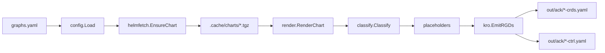

# Copilot Instructions for ack-kro-gen

## Project Overview
This Go CLI generates **KRO ResourceGraphDefinitions (RGDs)** from AWS ACK controller Helm charts. It automates pulling ACK charts via Helm SDK, rendering them in-memory, performing placeholder substitution, and emitting deterministic graph definitions.

## Architecture & Data Flow



**Pipeline Overview:**
1. **graphs.yaml** → User-defined service configurations
2. **config.Load** → Parse and validate with smart defaults
3. **helmfetch** → Download/cache OCI charts from ECR
4. **render** → Helm SDK rendering + placeholder Phase 1 (literals → sentinels)
5. **classify** → Group objects (CRDs, Core, RBAC, Deployments, Others)
6. **placeholders** → Phase 2 (sentinels → schema refs) during YAML write
7. **kro** → Build RGDs with deterministic ordering
8. **Output** → Separate CRD and controller RGD files per service

**Package Responsibilities:**
- **`cmd/ack-kro-gen/main.go`**: Entry point with Cobra CLI, coordinates the full pipeline
- **`internal/config`**: Defines `ValuesSpec` struct mirroring ACK Helm values schema
- **`internal/helmfetch`**: Downloads/caches OCI charts using pure Helm SDK (no shell commands)
- **`internal/render`**: Loads charts, applies templating, splits CRDs from controller manifests
- **`internal/classify`**: Groups K8s objects by type (CRDs → Core → RBAC → Deployments → Others)
- **`internal/placeholders`**: Two-phase replacement: runtime sentinels → schema references
- **`internal/kro`**: Builds final RGD YAML with deterministic ordering and schema integration

## Key Patterns

### Placeholder System (Critical for Understanding)
Two-phase transformation in `internal/placeholders/`:
1. **Runtime sentinels**: Replace literal values (e.g., `ack-s3-controller` → `_NAME_`)
2. **Schema references**: Convert sentinels to KRO schema paths (`_NAME_` → `${schema.spec.name}`)

```go
// Always use ApplyRuntimeSentinels first, then ApplySentinelToSchema
body = placeholders.ApplyRuntimeSentinels(body, runtimeSentinels)
body = placeholders.ApplySentinelToSchema(body)
```

The transformation happens in two places:
- **During render** (`internal/render/render.go`): Applies `ApplyRuntimeSentinels` to CRDs and controller manifests
- **During write** (`internal/kro/kro.go`): Applies `ReplaceYAMLScalars` which calls `ApplySentinelToSchema` on all scalar YAML nodes

Note: `ApplySchemaDefaults` exists but is only used when materializing concrete defaults, not in the normal generation flow.

### Deterministic Output Ordering
Objects are classified and ordered consistently in `internal/classify/classify.go`:
- CRDs first (always before dependent resources)
- Core resources (ServiceAccount, Service, ConfigMap, Namespace)
- RBAC (ClusterRole, Role, bindings)
- Deployments
- Others

### Chart Handling Conventions
- Use **Helm SDK only** - never shell out to `helm` commands
- Charts cached in `.cache/charts/` for offline reproducibility
- CRDs extracted via `ch.CRDObjects()` (no templating applied)
- Controller manifests rendered via `engine.Engine{}.Render()`

## Development Workflows

### Building & Running
```bash
# Build CLI executable
go build -o ack-kro-gen ./cmd/ack-kro-gen

# Generate RGDs (online mode)
./ack-kro-gen --charts-cache .cache/charts --offline=false --graphs graphs.yaml --out out --concurrency 6

# Offline mode (requires pre-cached charts)
./ack-kro-gen --charts-cache .cache/charts --offline=true --graphs graphs.yaml --out out
```

### Adding New AWS Services
1. Add entry to `graphs.yaml` with `service` and `version` (minimum required)
2. Override defaults only when needed (see `config.ValuesSpec` for available fields)
3. Run CLI to generate `out/ack/<service>-crds.yaml` and `out/ack/<service>-ctrl.yaml`

### Testing Approach
Testing is performed via agent-based validation, not traditional Go unit tests:
- Validate outputs offline using cached charts (no network access during validation)
- Focus on placeholder substitution correctness
- Validate deterministic RGD resource ordering
- Test schema reference generation accuracy
- Validate completeness of generated RGDs against chart contents
- Validate CEL expressions and paths
- Ensure Conditionals in RGDs match chart logic
- Use `./go.sh` script to regenerate and inspect outputs for manual validation

## Project-Specific Conventions

### File Organization
- `internal/` packages are domains-focused, not layer-focused
- Each RGD split into separate files: `<service>-crds.yaml` and `<service>-controller.yaml`
- Configuration driven by `graphs.yaml` with smart defaults

### Reference Material
The `refs/` directory contains read-only upstream artifacts for analysis and comparison only.

**Important:** `refs/` is **gitignored** and exists only in local development environments for agent assistance. It is not synced to the repository.

**`refs/ec2/`** — EC2 controller reference from [aws-controllers-k8s/ec2-controller](https://github.com/aws-controllers-k8s/ec2-controller):
- `helm/` — Raw ACK Helm chart structure (Chart.yaml, values.yaml, values.schema.json, crds/, templates/)
- `config/` — Kustomize manifests (controller/, rbac/, crd/, overlays/) showing canonical ACK deployment patterns

**`refs/kro/`** — Basic ResourceGraph examples from [kubernetes-sigs/kro](https://github.com/kubernetes-sigs/kro):
- `aws/` — AWS-focused graphs including `ack-controller/` (multi-controller RGD examples), `s3bucket/`, `eks-cluster-mgmt/`, etc.
- `azure/`, `gcp/`, `kubernetes/` — Cross-cloud and core K8s graph patterns
- Use these to understand KRO schema design, placeholder patterns, and resource composition strategies

**Usage guidelines:**
- **Available locally only** — `refs/` exists on developer machines for agent context, not in git
- **Compare** generated outputs against these references to validate structure and conventions
- **Inspect** for debugging placeholder logic, schema defaults, or RBAC patterns
- **Never modify** files in `refs/` — they represent upstream truth
- **Never copy** directly into `out/` — all outputs must be dynamically generated from Helm charts
- **Never commit** `refs/` to git — it's gitignored by design for local agent use only

**`out/ack/`** — CLI-generated RGD outputs (also read-only in normal workflow):
- `<service>-crds.yaml` and `<service>-ctrl.yaml` per service in the `ack/` subdirectory
- Example: `out/ack/s3-crds.yaml`, `out/ack/s3-ctrl.yaml`
- Regenerate by running the CLI, not by manual edits
- The `ack/` subdirectory organizes ACK controller RGDs separately from potential future graph types

### Error Handling
- Fail fast with descriptive context: `fmt.Errorf("context: %w", err)`
- Use `golang.org/x/sync/errgroup` for concurrent chart processing
- Log progress with service names and timing

### Dependencies
- **Helm SDK v3.15.4**: Core chart operations
- **spf13/cobra**: CLI framework
- **gopkg.in/yaml.v3**: YAML processing (preserve formatting)
- No external binaries or shell dependencies

## Critical Integration Points
- **Schema defaults**: Built from chart's `values.yaml` (extracted from `.cache/charts/<service>-chart-<version>.tgz`) merged with user overrides from `graphs.yaml`
- **KRO resource IDs**: Generated as `<kind>-<name>` in kebab-case for consistency
- **Multi-service concurrency**: Controlled via `--concurrency` flag with errgroup coordination
- **OCI registry**: Charts pulled from `public.ecr.aws/aws-controllers-k8s/<service>-chart`

When modifying placeholder logic, always test both phases and verify schema reference paths match KRO expectations.